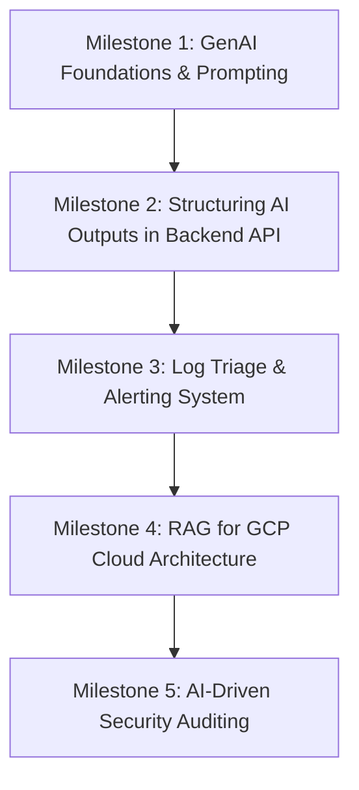

# Learning Roadmap: Applied GenAI for Backend Systems

This roadmap is tailored to your IDP goals as an experienced software engineer transitioning into AI integration. We focus on building hands-on capabilities that directly address your target business impacts.

---

## 📅 Roadmap Overview

---

## 📘 KPI 1: Recommended Courses
You have selected:
* **Selected:** **Google Cloud Skills Boost - Generative AI Learning Path** (Free, comprehensive modules covering LLM foundations, Vertex AI, and integrating Gemini into applications).

---

## 🛠️ KPI 2: Hands-on Projects (Python Workspace)

All exercises will be written in **Python 3.9+** and are organized into folders within `/Users/krishabhi/Downloads/AI/genai-backend-learning/`.

### 🏁 Milestone 1: Foundations & API Mechanics (Folder: `milestone1_foundations/`)
* **Concept:** Understanding LLMs (context windows, system instructions, temperature) and calling the Gemini API in Python using `google-generativeai`.
* **Hands-on Exercise:** Write a Python script to interact with Gemini, handle API errors, and manage rate limits.

### 🚨 Milestone 2: Intelligent Alert Triaging & Debugging (Folder: `milestone2_log_triage/`)
* **Impact:** *Improve alerting system and reduce debugging effort.*
* **Concept:** Feeding application log stack traces into Gemini to categorize errors, explain root causes, and suggest code fixes.
* **Hands-on Exercise:** Build a mini-service that consumes raw log messages, uses Gemini to format them into structured JSON alerts, and flags severity.

### ☁️ Milestone 3: RAG (Retrieval-Augmented Generation) for GCP Architecture (Folder: `milestone3_rag_gcp/`)
* **Impact:** *Better design and choice of cloud technology.*
* **Concept:** Injecting relevant service docs/architecture blueprints into prompt context using embeddings and a local vector search engine.
* **Hands-on Exercise:** Build a semantic search tool that reads GCP guidelines, indexes them in a local vector store, and answers design questions using Gemini.

### 🔒 Milestone 4: Code Auditing & Anomaly Detection (Folder: `milestone4_security_audit/`)
* **Impact:** *Improve security.*
* **Concept:** Using LLMs to perform static analysis on backend code or API request logs to identify security threats like SQL injection or unsafe auth practices.
* **Hands-on Exercise:** Create a command-line auditing tool that scans source files against security policy prompts.

---

## 📈 Tracking Progress
- [ ] Complete selected GenAI Course (Google Cloud Skills Boost)
- [ ] Milestone 1: API Foundations
- [ ] Milestone 2: Log Triage Alerting
- [ ] Milestone 3: RAG for GCP Architecture
- [ ] Milestone 4: AI Security Auditing

